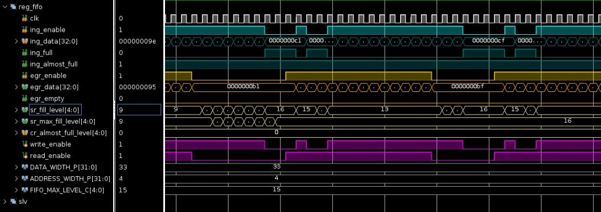

# Synchronous FIFO


A single-clock-domain FIFO parameterised on data width and depth. It picks its
own storage: small FIFOs become a register file, larger ones a RAM, and the
interface is identical either way.

```
DATA_WIDTH_P * 2**ADDR_WIDTH_P <= MAX_REG_BYTES_P * 8   ->  reg_sp_rf  (fifo_register)
                                                  else  ->  ram_sdp
```

That threshold is the only reason to think about the backend. A register file
reads combinationally and costs flops; a RAM costs a cycle of read latency and
scales. Setting `MAX_REG_BYTES_P` is how a user says which side of that trade
this instance is on.

## Cores

| VLNV | Contents |
|------|----------|
| `akerlund::fifo:1.0.0` | `fifo`, `fifo_register` |
| `akerlund::fifo_example_py:0` | the cocotb/pyUVM testbench |

Depends on `akerlund::memory_ram:1.0.0` and `akerlund::memory_reg:1.0.0` from
[`rtl_common`](https://github.com/akerlund/rtl_common), carried as a submodule.

```sh
git clone --recurse-submodules git@github.com:akerlund/rtl_fifo.git
```

## Ports

| Signal | Dir | Meaning |
|--------|-----|---------|
| `clk`, `rst_n` | in | clock, active-low reset |
| `ing_enable` | in | write this cycle |
| `ing_data` | in | write data |
| `ing_full` | out | no space |
| `ing_almost_full` | out | fill level has reached `cr_almost_full_level` |
| `egr_enable` | in | read this cycle |
| `egr_data` | out | read data |
| `egr_empty` | out | nothing to read |
| `sr_fill_level` | out | current occupancy |
| `sr_max_fill_level` | out | high-water mark since reset |
| `cr_almost_full_level` | in | threshold driving `ing_almost_full` |

A write is accepted when `ing_enable` is high and the FIFO is either not full or
is being read in the same cycle; a read happens when `egr_enable` is high and
the FIFO is not empty.

`sr_max_fill_level` is the buffer-sizing output: it records how deep this FIFO
ever got, which is the number that says whether `ADDR_WIDTH_P` is right.

## Instantiation

```verilog
fifo #(
  .DATA_WIDTH_P         ( 32                   ),
  .ADDR_WIDTH_P         ( 3                    ),
  .MAX_REG_BYTES_P      ( 256                  )
) fifo_i0 (
  .clk                  ( clk                  ), // input
  .rst_n                ( rst_n                ), // input
  .ing_enable           ( ing_transaction      ), // input
  .ing_data             ( ing_tuser            ), // input
  .ing_full             ( wp_fifo_full         ), // output
  .ing_almost_full      (                      ), // output
  .egr_enable           ( egr_transaction      ), // input
  .egr_data             ( egr_tuser            ), // output
  .egr_empty            ( rp_fifo_empty        ), // output
  .sr_fill_level        ( sr_fill_level        ), // output
  .sr_max_fill_level    ( sr_max_fill_level    ), // output
  .cr_almost_full_level ( cr_almost_full_level )  // input
);
```

## Simulation waveform



## Running

```sh
cd py
./run_fusesoc.sh --target sim     # cocotb/Verilator
./run_fusesoc.sh --target lint
fusesoc run --target rtl akerlund::fifo:1.0.0    # lint the RTL alone
```

There are also formal scripts under [`scripts/`](scripts/) and SVA under
[`sva/`](sva/), which bind properties to `fifo_register`.
